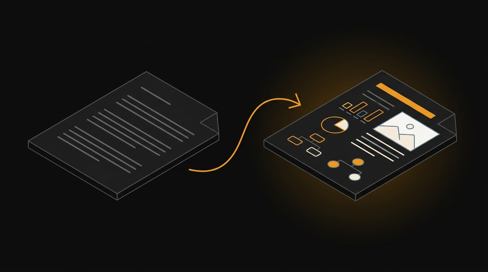

# post-to-visual



Turn an article, post, or dense note into an **illustrated, easy-to-read web page** — one
self-contained HTML file you can share or re-read. (圖文好讀版 means "illustrated easy-read
version" in Chinese.)

**You give it** a link or some text.
**You get** one `.html` file: a clear headline, the content split into sections, the key ideas
turned into clean diagrams (and optional illustrations), a glossary for the jargon, and light +
dark themes — no build step, nothing to install to view it.

→ **See one:** open [`examples/art-of-war-laying-plans/laying-plans.html`](examples/art-of-war-laying-plans/laying-plans.html)
in a browser. It was built with **no API key** — every visual is hand-drawn SVG.

> Works with **zero API keys.** AI illustrations are optional; a page stands on diagrams and
> typography alone.

---

## The idea in 30 seconds

It is **not a template.** It's a short pipeline plus a toolkit:

> **read → break into sections → pick the right visual for each → assemble one HTML file → check it**

You (or an AI assistant) make the judgment calls. The toolkit hands you tested parts — diagram
recipes, color palettes, a checker — so you're not reinventing the basics or shipping a broken
page. Built as a [Claude Code](https://claude.com/claude-code) skill, but the scripts and
galleries work on their own.

---

## Three ways to use it

**1 · With an AI assistant (the intended way).** Drop this folder into your Claude Code skills
directory and say *"make this readable"* / *"visualize this article"* with a URL or pasted text.
The assistant follows the pipeline in [`SKILL.md`](SKILL.md). (Agents: see [`AGENTS.md`](AGENTS.md).)

**2 · With the `p2v` CLI** — no AI, nothing to install. Scaffold and check pages yourself; write
the prose by hand or with any tool.
```bash
alias p2v='python3 /path/to/post-to-visual/scripts/cli.py'
p2v new my-post --palette pine --title "My Post"   # starter page + spec + assets folder
p2v palette "#7C3AED"                               # a color palette from one hex
p2v gallery recipes                                  # browse the diagram recipes
p2v verify my-post.html                              # catch problems before you ship
p2v serve .                                          # preview at http://localhost
```

**3 · Just the checker** — point it at any HTML page (zero install, no deps):
```bash
python3 scripts/verify.py path/to/page.html        # add --json for machine output
```
It flags the bugs that actually ship: broken in-page links, social-preview tags that aren't
absolute URLs (→ blank preview when shared), a missing favicon, images that don't load, JPEG
data saved as a `.png` (breaks link previews on LINE), and white text on a color that turns
unreadable in dark mode. Exit code 1 if anything fails.

---

## SVG-only mode (no image budget? no problem)

You don't need an image API. A page is fully valid — often **better** — with no AI pictures at
all: carry it on the SVG diagram recipes plus strong typography. Pure-prose essays in particular
look more intentional without stock-feel art. The example above is built this way, so you can
reproduce it with no key.

---

## What's in the box

| Path | What it is |
|------|-----------|
| [`SKILL.md`](SKILL.md) | The step-by-step pipeline (the "how to build a page" guide) |
| [`AGENTS.md`](AGENTS.md) · [`llms.txt`](llms.txt) | Machine-readable guides for AI agents and LLMs |
| `scripts/cli.py` (`p2v`) | One command for everything: scaffold, palette, images, verify, preview |
| `scripts/verify.py` | The pre-ship checker. No dependencies. `--json` for agents |
| `scripts/gen_palette.py` | A full light + dark color palette from a single accent color |
| `scripts/gen_illustrations.py` | Optional AI illustrations (Google Gemini) from a small JSON file |
| `assets/svg-recipes/recipes.html` | 8 ready-to-copy diagram patterns + a "which chart when" guide |
| `assets/themes.css` · `themes.html` | 3 color palettes with a live preview you can toggle |
| `assets/components/components.html` | 6 optional interactive widgets (quiz, before/after slider, tabs…) |
| `knowledge/` | Reference notes on clear writing and clean single-file HTML |
| `examples/` | A complete sample you can open and reproduce |

The three `.html` files in `assets/` are **live galleries** — open them in a browser, toggle
light/dark, and copy any piece with a button.

---

## Using this with AI agents

post-to-visual is built for an era where an AI does much of the work, so its instructions are
written for machines to read and act on, not just humans:

- **[`SKILL.md`](SKILL.md)** — the full pipeline an assistant follows to build a page.
- **[`AGENTS.md`](AGENTS.md)** — the rules and common tasks for any AI coding agent editing this
  repo (the [agents.md](https://agents.md) convention, read by Claude Code, Cursor, and others).
- **[`llms.txt`](llms.txt)** — a one-screen map of the repo in the [llms.txt](https://llmstxt.org)
  format, so an LLM can find the right file fast.
- **`verify.py --json`** — gives an agent a hard pass/fail it can parse, so it self-checks its
  output instead of guessing whether the page is correct.

Point your agent at `AGENTS.md` and it can build or extend a page without breaking the rules.

---

## Config

- **API key** (only for AI images): set `GEMINI_API_KEY`, or pass `--env path/to/.env`, or drop a
  `.env` in the spec's folder / up to the repo root / `~/.config/post-to-visual/.env`.
- **Palette**: pick `editorial` / `pine` / `slate` from `assets/themes.css`, or generate your own
  with `p2v palette "#yourhex"`. Color names in the CSS are *roles* (primary, secondary…), so
  diagrams keep working when you swap palettes — only the hues change.
- **Social-preview URLs**: link-preview tags must be absolute, so a page needs your public base
  URL — the page sits at `<base>/<slug>`, its images at `<base>/<slug>-assets/images/`.

---

## Notes & license

- **AI image generation calls a paid API** (Google Gemini's image model, nicknamed "nano
  banana"). You bring your own key and pay for what you generate. The SVG-only path is free.
- That image model garbles any text it draws, so prompts say "no text" and all labels live in
  the HTML/SVG. It returns JPEG data, so generated files end in `.jpg`.
- Sample pages load web fonts from Google Fonts — swap or self-host as you like.
- **License: [MIT](LICENSE).** The `knowledge/` notes are the author's own; adapt freely, but
  review before redistributing verbatim.
